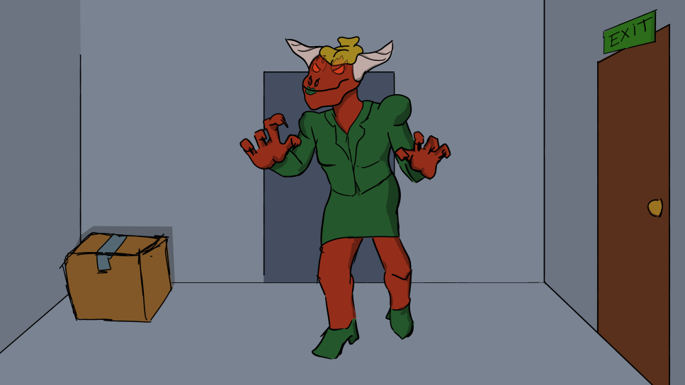
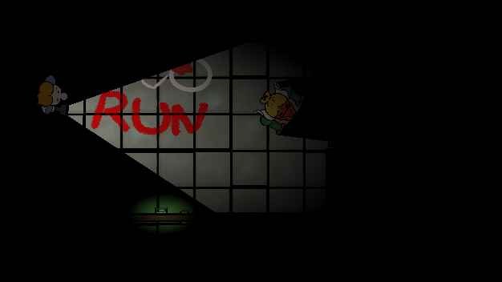
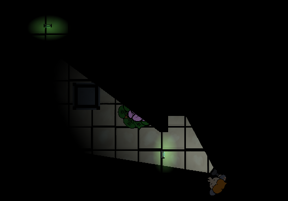
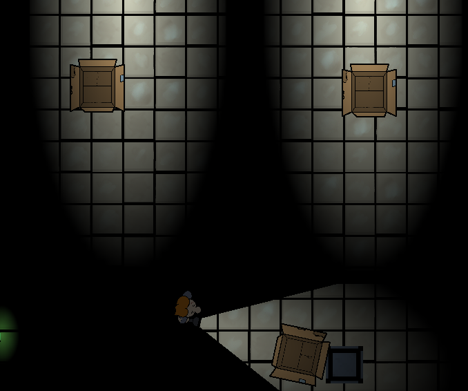

# 🎮 Office Nightmare

| Destination | Link |
| :--- | :--- |
| **Play the Game (Web)** | https://github.com/Middle-Endian-HackYeah25/OfficeNightmare |
| **Game Repository** | https://middle-endian-hackyeah25.github.io/OfficeNightmare |



A brief, catchy one-sentence summary of your game (e.g., A top-down survival horror game where light is your only weapon against the darkness).

## 📜 Mechanics & Premise

### **Office Nightmare** is a horror game focusing on traversing mysterious nooks and crannies of haunted office place.

**The Premise:**
*(Try to survive, till you find the exit)*
This game is a top-down based slice of the bigger concept of a puzzle game with game mechanics presentation and immersive story. 


### **Core Mechanics:**

| Mechanic | Description |
| :--- | :--- |
| **Beam of light from the flashlight** | Light repels, damages, or freezes enemies; your primary defense. |
| **Other custom lights** | Manage power/batteries; essential resources to ward off darkness. |
| **Fully functional scene and player movement** | Intuitive top-down movement and physics-based collision. |
| **Light switches** | Interactable elements to toggle area lighting and modify enemy behavior. |
| **Door keys** | Scavenge and use specific items to unlock progression paths. |
| **Soundtracks** | Dynamic music and sound effects enhance atmosphere and tension. |
| **Changing items position while not in the light** | Environmental objects move or change state when outside the player's view/light source. |

***

## 🖼️ Gameplay Screenshots




***

## 💻 Technical Details

This project was developed primarily using the [ENGINE NAME] engine.

### **Key Features**

* **Dynamic 2D Lighting:** Real-time shadows and light occlusion for a tense atmosphere.
* **Custom GDScript Controller:** Smooth, physics-based movement and turning for the main character.
* **TileMap-Based Level Design:** Efficient collision and occlusion using TileMap layers.
* **Proportional Angular Forces:** Controlled turning and snapping for interactive objects like doors and enemies.
* **[Add any other major technical features: Shaders, UI, Networking, etc.]**

### **Technologies Used**

| Category | Technology / Language | Details |
| :--- | :--- | :--- |
| **Game Engine** | Godot 4.5  |
| **Language** | GDScript | Used for core game logic and systems. |
| **Design / Art** | Photoshop | Used for pixel art, sprites, and animations. |
| **Version Control** | GitHub | |

***

## 🚀 Get Started (Running the Project)

1.  **Clone the Repository:**
    ```bash
    git clone [YOUR REPO LINK HERE]
    ```
2.  **Open in [GODOT]:**
    * Open the [Godot] editor.
    * Navigate to the cloned folder.
3.  **Run:**
    * Set your main scene (e.g., `main_scene.tscn`) as the main scene.
    * Press F5 to run the project.

***

## 🔗 Links

| Destination | Link |
| :--- | :--- |
| **Play the Game (Web)** | https://github.com/Middle-Endian-HackYeah25/OfficeNightmare |
| **Game Repository** | https://middle-endian-hackyeah25.github.io/OfficeNightmare |
